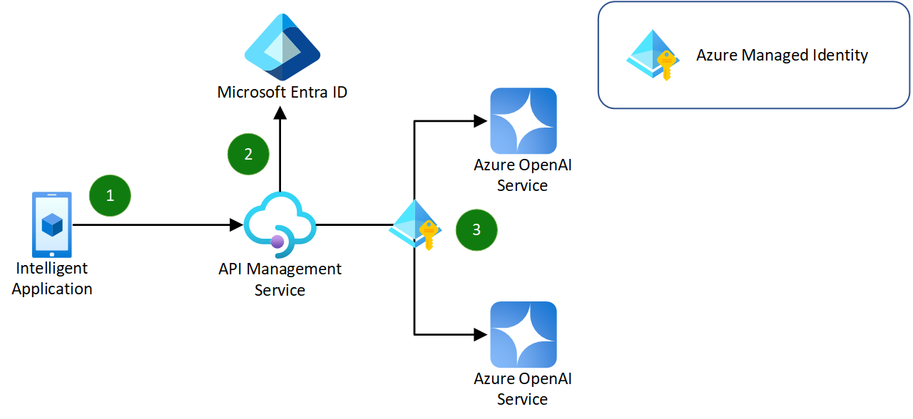

# Azure OpenAI Service Load Balancing with Azure API Management

This sample demonstrates how to use [Azure API Management](https://learn.microsoft.com/en-us/azure/api-management/api-management-key-concepts) to load balance requests to multiple instances of the [Azure OpenAI Service](https://learn.microsoft.com/en-us/azure/ai-services/openai/overview).

This approach takes advantages of the static, round-robin load balancing technique using policies in Azure API Management. This approach provides the following advantages:

- Support for multiple Azure OpenAI Service deployments behind a single Azure API Management endpoint.
- Remove complexity from application code by abstracting Azure OpenAI Service instance and API key management to Azure API Management using policies and named values from Azure Key Vault.
- Retry logic for failed requests between Azure OpenAI Service instances.

For more information on topics covered in this sample, refer to the following documentation:

- [Understand policies in Azure API Management](https://learn.microsoft.com/en-us/azure/api-management/api-management-howto-policies)
- [Error handling in Azure API Management policies](https://learn.microsoft.com/en-us/azure/api-management/api-management-error-handling-policies)
- [Manage secrets using named values in Azure API Management policies](https://learn.microsoft.com/en-us/azure/api-management/api-management-howto-properties?tabs=azure-portal)

## Flow

The following diagram illustrates the simplified user flow of the sample.

1. A user makes a request to a deployed Azure API Management API that is configured using the Azure OpenAI API specification.
   - The API Management API is configured with a policy that uses a static, round-robin load balancing technique to route requests to one of the Azure OpenAI Service instances.
2. Based on the selected Azure OpenAI Service instance, the API key for the instance is retrieved from Azure Key Vault.
3. The original request including headers and body are forwarded to the selected Azure OpenAI Service instance, along with the specific API key header.

If the request fails, [the policy](./infra/policies/round-robin-policy.xml) will retry the request with the next Azure OpenAI Service instance, and repeat in a round-robin fashion until the request succeeds or a maximum of 3 attempts is reached.

### Components

- [**Azure OpenAI Service**](https://learn.microsoft.com/en-us/azure/ai-services/openai/overview), a managed service for OpenAI GPT models that exposes a REST API.
- [**Azure API Management**](https://learn.microsoft.com/en-us/azure/api-management/api-management-key-concepts), a managed service that provides a gateway to the backend Azure OpenAI Service instances.
- [**Azure Key Vault**](https://learn.microsoft.com/en-us/azure/key-vault/key-vault-overview), a managed service that stores the API keys for the Azure OpenAI Service instances as secrets used by Azure API Management.
- [**Azure Managed Identity**](https://learn.microsoft.com/en-us/entra/identity/managed-identities-azure-resources/overview), a user-defined managed identity for Azure API Management to access Azure Key Vault.
- [**Azure Bicep**](https://learn.microsoft.com/en-us/azure/azure-resource-manager/bicep/overview?tabs=bicep), used to create a repeatable infrastructure deployment for the Azure resources.

## Getting Started

To deploy the infrastructure and test load balancing using Azure API Management, you need to:

### Prerequisites

- Install the latest [**.NET SDK**](https://dotnet.microsoft.com/download).
- Install [**PowerShell Core**](https://docs.microsoft.com/en-us/powershell/scripting/install/installing-powershell).
- Install the [**Azure CLI**](https://docs.microsoft.com/en-us/cli/azure/install-azure-cli).
- Install [**Visual Studio Code**](https://code.visualstudio.com/) with the [**Polyglot Notebooks extension**](https://marketplace.visualstudio.com/items?itemName=ms-dotnettools.dotnet-interactive-vscode).
- Apply for access to the [**Azure OpenAI Service**](https://learn.microsoft.com/en-us/azure/ai-services/openai/overview#how-do-i-get-access-to-azure-openai).

### Run the sample notebook

The [**Sample.ipynb**](./Sample.ipynb) notebook contains all the necessary steps to deploy the infrastructure using Azure Bicep, and make requests to the deployed Azure API Management API to test load balancing between two Azure OpenAI Service instances.

> **Note:** The sample uses the [**Azure CLI**](https://docs.microsoft.com/en-us/cli/azure/install-azure-cli) to deploy the infrastructure from the [**main.bicep**](./infra/main.bicep) file, and PowerShell commands to test the deployed APIs.

The notebook is split into multiple parts including:

1. Login to Azure and set the default subscription.
2. Deploy the Azure resources using Azure Bicep.
3. Test load balancing using Azure API Management.
4. Cleanup the Azure resources.

Each step is documented in the notebook with additional information and links to relevant documentation.
